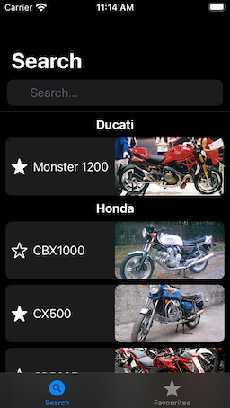
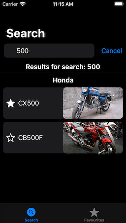
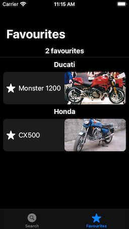
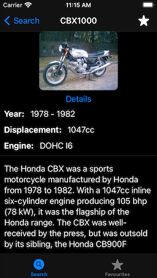

# BikeWiki-SwiftUI

This is a minimal SwiftUI / Combine demo app. The goal is to provide a basic UI with less emphasis on visuals and more on using Combine to drive a SwiftUI app with little to no imperative code.

## Table of Contents

<!--ts-->
* [Screenshots](#screenshots)
* [Prerequisites](#prerequisites)
  * [Build environment](#build-environment) 
  * [Dependencies](#dependencies) 
* [TODO](#todo)
<!--te-->

## Screenshots

## Prerequisites

### Build environment

* Xcode 12 or newer
* iOS14 or newer simulator or device

### Dependencies

Dependencies are managed using SwiftPM.

* [SDWebImage](https://github.com/SDWebImage/SDWebImage)
* [swift-snapshot-testing](https://github.com/pointfreeco/swift-snapshot-testing)

## TODO

* More functional and snapshot tests
* Improved layout for `.regular` size classes
* Additional features assuming they actually exercise new Combine functionality
* Better documentation
 
